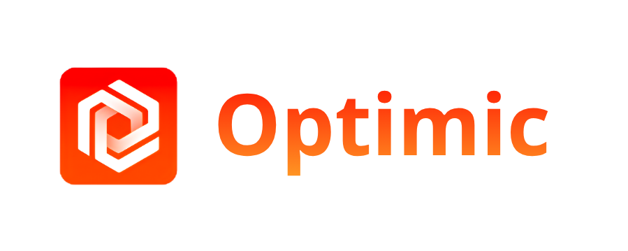
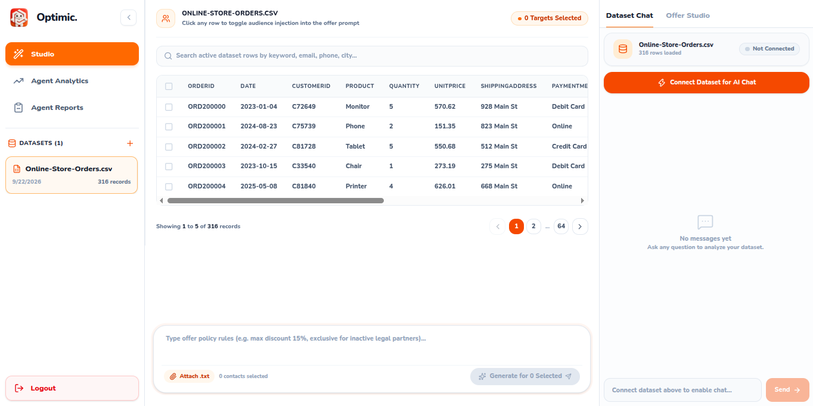
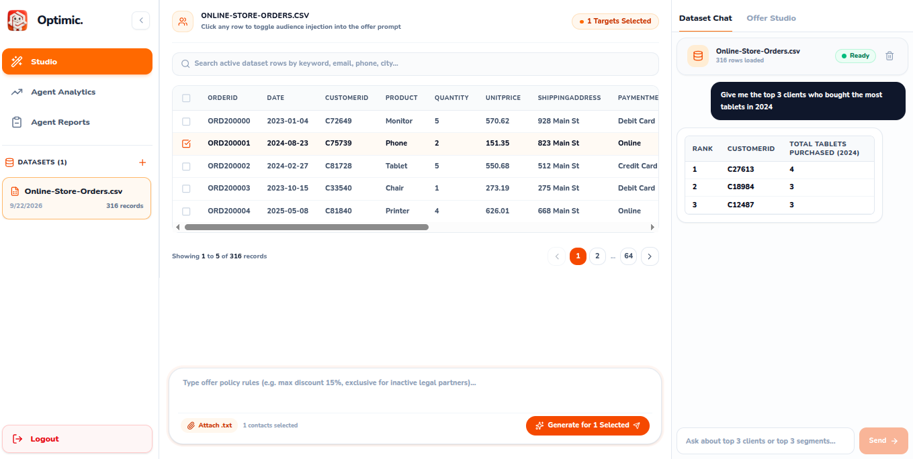
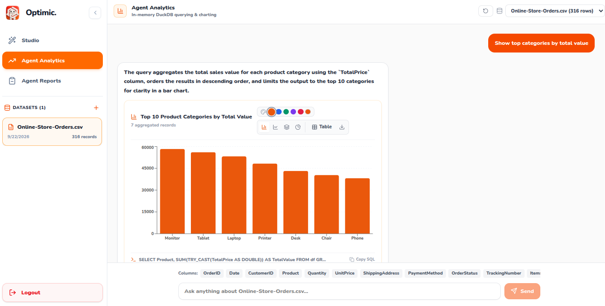
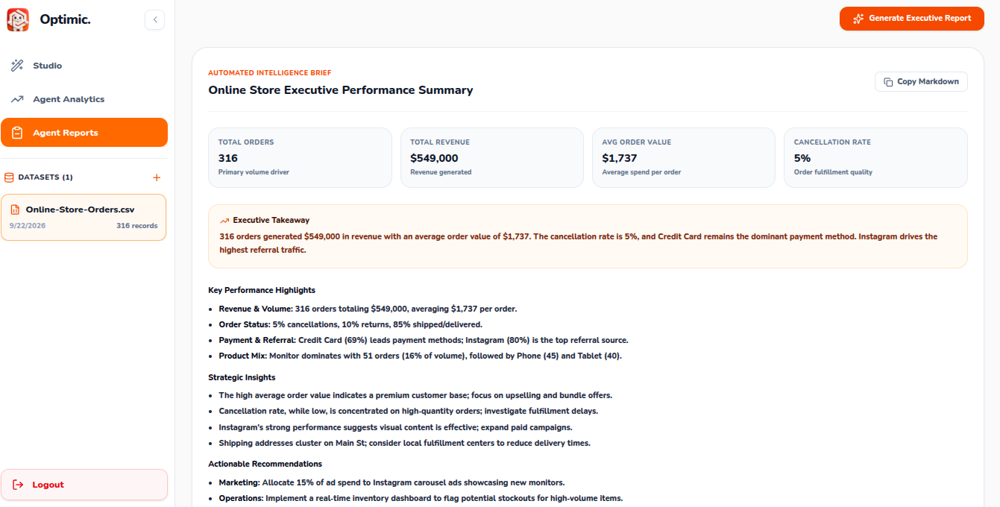

<div align="center">
  
</div>

**Optimic** is an AI-powered platform that automatically generates marketing offres, anaylse your customers. generate reports.


## 💡 What is Optimic?
Writing custom discount offers by hand takes a lot of time, and it is easy to make mistakes (like giving discounts that are too big). **Optimic** solves this by using a team of AI agents that work together under a central supervisor to read your data, check business rules, and write high-converting copy in seconds **(~2.3s)**.

## 🎯 What can you do with Optimic?
With **Optimic**, you can upload customer files, select specific target rows, and produce personalized marketing promotions safely. Instead of moving between spreadsheets and copy tools, Optimic scores your leads, generates compliant text, shows data with charts, and writes executive summaries in one dashboard.

## 🚀 Core Features

### 🏷️ Multi-Agent Offer Studio
Select customer rows directly from your CSV files, enter your policy rules (such as max discount limits or coupon names), and let the agents generate tailored promotional copy instantly.

<div align="center">
  
</div>

### 💬 Haut Gamme Assistant
Chat directly with your dataset using simple, everyday language. Instead of writing complex formulas or filtering spreadsheets manually, just ask questions like "Give me the top 3 clients who bought the most tablets in September" or "Show me inactive users from last week". The assistant quickly scans your loaded data in memory, gets the exact metrics, and returns clear answers inside the studio.

<div align="center">
  
</div>


### 📊 Agent Analytics
You can ask questions in plain English and view automated bar charts, distributions, and frequency counts without writing complex code.

<div align="center">
  
</div>


### 📑 Marketing Reporting Agent
Generate complete executive reports in one click. The reporting agent reads your dataset to display total records, unique addresses, domain distributions, and strategic takeaways to help you plan your next campaign.

<div align="center">
  
</div>


## ⚙️ Installation

```bash
# 1. Clone the repository
git clone https://github.com/KaraniAbdellah/optimic.git
cd optimic

# 2. Frontend SetUp
npm install
cp .env.example .env
npm run dev

# 3. Backend SetUp
curl -LsSf https://astral.sh/uv/install.sh | sh
cd backend
uv venv
source .venv/bin/activate
uv pip install requirements.txt
cp .env.example .env
uv run uvicorn main:app --reload --port 8000
```


## 📁 Project Structure

``` bash
optimic/
│
├── backend/                         # Backend API and AI logic
│   ├── main.py                      # Main FastAPI application and API routes
│   ├── agents.py                    # AI agents and agent workflow
│   ├── state.py                     # Shared state for the agent workflow
│   ├── auth.py                      # Authentication and user management
│   ├── models.py                    # Database and API data models
│   ├── analyse.py                   # Data analysis and analytics
│   ├── chatbot.py                   # Chatbot logic
│   ├── reports.py                   # Report generation
│   ├── requirements.txt              # Python dependencies
│   ├── Dockerfile                   # Backend Docker configuration
│   │
│   └── prompts/                     # Prompts used by AI agents
│
├── frontend/                        # Frontend React application
│   └── src/
│       ├── App.tsx                  # Main React application
│       ├── main.tsx                 # React application entry point
│       ├── ProtectedRoute.tsx        # Protected/authenticated routes
│       ├── features/                # Application features
│       ├── global/                  # Shared application types and context
│       └── pages/                   # Main application pages
├── .env.example                     # Example environment variables
```


## 🛠️ Technical Stack
**Architecture:** Multi-agent supervisor pattern with centralized orchestration, including Data Fetcher, Scoring Agent, Generation Agent, Validation Agent, and Optimization Agent.

**Frontend:** React, Tailwind CSS

**Backend:** FastAPI

**Database:** Qdrant, DuckDB

**DevOps & Cloud:** Docker, GitHub Actions, CI/CD, Google Cloud Run

## 🤝 Contribution
Contributions are welcome.

**Created by <a href="https://www.linkedin.com/in/abdellah-karani-965928294/">@abdellah_karani</a>**
